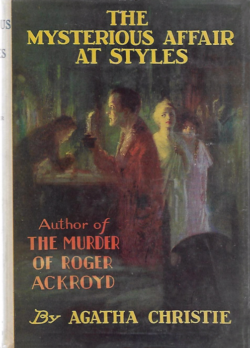

# The Mysterious Affair at Styles
### by Agatha Christie  
---
## Contents

<table summary="Contents" style="margin-right: auto; margin-left: auto">

<tr>
<td>CHAPTER I.</td> <td> <a href="chapter-01.md">I GO TO STYLES</a></td>
</tr>

<tr>
<td>CHAPTER II.</td> <td> <a href="chapter-02.md">THE 16TH AND 17TH OF JULY</a></td>
</tr>

<tr>
<td>CHAPTER III.</td> <td> <a href="chapter-03.md">THE NIGHT OF THE TRAGEDY</a></td>
</tr>

<tr>
<td>CHAPTER IV.</td> <td> <a href="chapter-04.md">POIROT INVESTIGATES</a></td>
</tr>

<tr>
<td>CHAPTER V.</td> <td> <a href="chapter-05.md">&ldquo;IT ISN&rsquo;T STRYCHNINE, IS IT?&rdquo;</a></td>
</tr>

<tr>
<td>CHAPTER VI.</td> <td> <a href="chapter-06.md">THE INQUEST</a></td>
</tr>

<tr>
<td>CHAPTER VII.</td> <td> <a href="chapter-07.md">POIROT PAYS HIS DEBTS</a></td>
</tr>

<tr>
<td>CHAPTER VIII.</td> <td> <a href="chapter-08.md">FRESH SUSPICIONS</a></td>
</tr>

<tr>
<td>CHAPTER IX.</td> <td> <a href="chapter-09.md">DR. BAUERSTEIN</a></td>
</tr>

<tr>
<td>CHAPTER X.</td> <td> <a href="chapter-10.md">THE ARREST</a></td>
</tr>

<tr>
<td>CHAPTER XI.&nbsp;&nbsp;</td> <td> <a href="chapter-11.md">THE CASE FOR THE PROSECUTION</a></td>
</tr>

<tr>
<td>CHAPTER XII.&nbsp;&nbsp;</td> <td> <a href="chapter-12.md">THE LAST LINK</a></td>
</tr>

<tr>
<td>CHAPTER XIII.&nbsp;&nbsp;</td> <td> <a href="chapter-13.md">POIROT EXPLAINS</a></td>
</tr>

</table>
