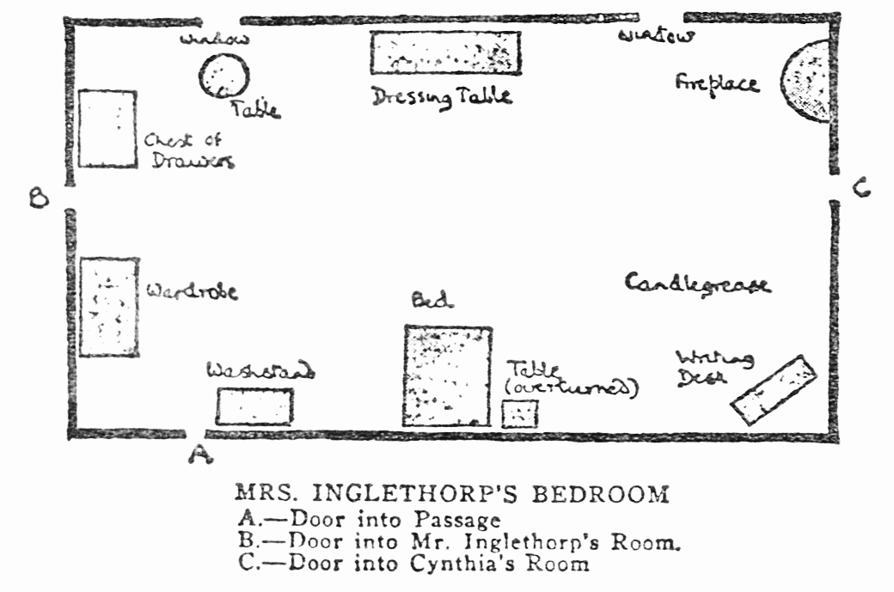
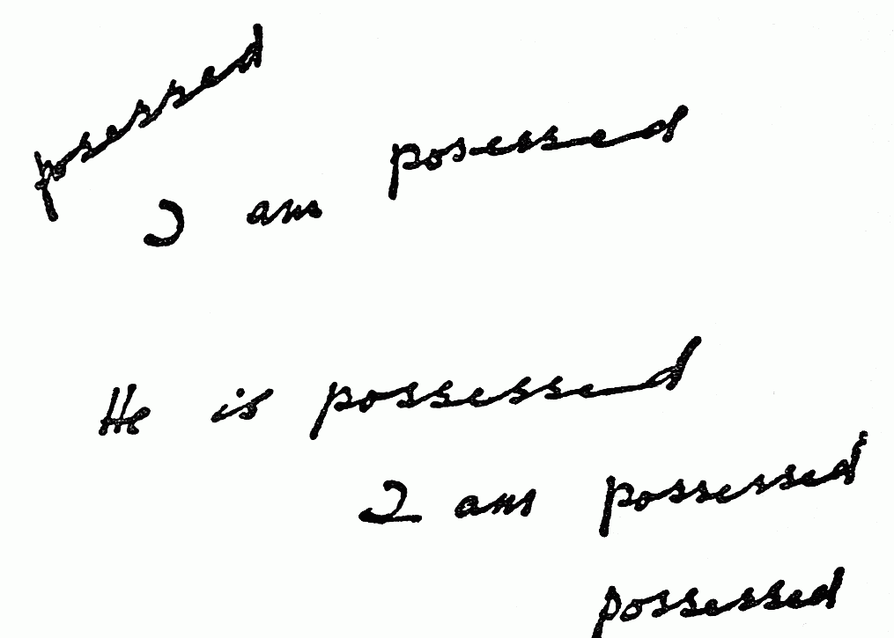

## CHAPTER IV. POIROT INVESTIGATES

The house which the Belgians occupied in the village was quite close to the
park gates. One could save time by taking a narrow path through the long grass,
which cut off the detours of the winding drive. So I, accordingly, went that
way. I had nearly reached the lodge, when my attention was arrested by the
running figure of a man approaching me. It was Mr. Inglethorp. Where had he
been? How did he intend to explain his absence?

He accosted me eagerly.

&ldquo;My God! This is terrible! My poor wife! I have only just heard.&rdquo;

&ldquo;Where have you been?&rdquo; I asked.

&ldquo;Denby kept me late last night. It was one o&rsquo;clock before
we&rsquo;d finished. Then I found that I&rsquo;d forgotten the latch-key after
all. I didn&rsquo;t want to arouse the household, so Denby gave me a
bed.&rdquo;

&ldquo;How did you hear the news?&rdquo; I asked.

&ldquo;Wilkins knocked Denby up to tell him. My poor Emily! She was so
self-sacrificing&mdash;such a noble character. She over-taxed her
strength.&rdquo;

A wave of revulsion swept over me. What a consummate hypocrite the man was!

&ldquo;I must hurry on,&rdquo; I said, thankful that he did not ask me whither
I was bound.

In a few minutes I was knocking at the door of Leastways Cottage.

Getting no answer, I repeated my summons impatiently. A window above me was
cautiously opened, and Poirot himself looked out.

He gave an exclamation of surprise at seeing me. In a few brief words, I
explained the tragedy that had occurred, and that I wanted his help.

&ldquo;Wait, my friend, I will let you in, and you shall recount to me the
affair whilst I dress.&rdquo;

In a few moments he had unbarred the door, and I followed him up to his room.
There he installed me in a chair, and I related the whole story, keeping back
nothing, and omitting no circumstance, however insignificant, whilst he himself
made a careful and deliberate toilet.

I told him of my awakening, of Mrs. Inglethorp&rsquo;s dying words, of her
husband&rsquo;s absence, of the quarrel the day before, of the scrap of
conversation between Mary and her mother-in-law that I had overheard, of the
former quarrel between Mrs. Inglethorp and Evelyn Howard, and of the
latter&rsquo;s innuendoes.

I was hardly as clear as I could wish. I repeated myself several times, and
occasionally had to go back to some detail that I had forgotten. Poirot smiled
kindly on me.

&ldquo;The mind is confused? Is it not so? Take time, *mon ami*. You are
agitated; you are excited&mdash;it is but natural. Presently, when we are
calmer, we will arrange the facts, neatly, each in his proper place. We will
examine&mdash;and reject. Those of importance we will put on one side; those of
no importance, pouf!&rdquo;&mdash;he screwed up his cherub-like face, and
puffed comically enough&mdash;&ldquo;blow them away!&rdquo;

&ldquo;That&rsquo;s all very well,&rdquo; I objected, &ldquo;but how are you
going to decide what is important, and what isn&rsquo;t? That always seems the
difficulty to me.&rdquo;

Poirot shook his head energetically. He was now arranging his moustache with
exquisite care.

&ldquo;Not so. *Voyons!* One fact leads to another&mdash;so we continue.
Does the next fit in with that? *A merveille!* Good! We can proceed. This
next little fact&mdash;no! Ah, that is curious! There is something
missing&mdash;a link in the chain that is not there. We examine. We search. And
that little curious fact, that possibly paltry little detail that will not
tally, we put it here!&rdquo; He made an extravagant gesture with his hand.
&ldquo;It is significant! It is tremendous!&rdquo;

&ldquo;Y&mdash;es&mdash;&mdash;&rdquo;

&ldquo;Ah!&rdquo; Poirot shook his forefinger so fiercely at me that I quailed
before it. &ldquo;Beware! Peril to the detective who says: &lsquo;It is so
small&mdash;it does not matter. It will not agree. I will forget it.&rsquo;
That way lies confusion! Everything matters.&rdquo;

&ldquo;I know. You always told me that. That&rsquo;s why I have gone into all
the details of this thing whether they seemed to me relevant or not.&rdquo;

&ldquo;And I am pleased with you. You have a good memory, and you have given me
the facts faithfully. Of the order in which you present them, I say
nothing&mdash;truly, it is deplorable! But I make allowances&mdash;you are
upset. To that I attribute the circumstance that you have omitted one fact of
paramount importance.&rdquo;

&ldquo;What is that?&rdquo; I asked.

&ldquo;You have not told me if Mrs. Inglethorp ate well last night.&rdquo;

I stared at him. Surely the war had affected the little man&rsquo;s brain. He
was carefully engaged in brushing his coat before putting it on, and seemed
wholly engrossed in the task.

&ldquo;I don&rsquo;t remember,&rdquo; I said. &ldquo;And, anyway, I don&rsquo;t
see&mdash;&mdash;&rdquo;

&ldquo;You do not see? But it is of the first importance.&rdquo;

&ldquo;I can&rsquo;t see why,&rdquo; I said, rather nettled. &ldquo;As far as I
can remember, she didn&rsquo;t eat much. She was obviously upset, and it had
taken her appetite away. That was only natural.&rdquo;

&ldquo;Yes,&rdquo; said Poirot thoughtfully, &ldquo;it was only natural.&rdquo;

He opened a drawer, and took out a small despatch-case, then turned to me.

&ldquo;Now I am ready. We will proceed to the château, and study matters on the
spot. Excuse me, *mon ami*, you dressed in haste, and your tie is on one
side. Permit me.&rdquo; With a deft gesture, he rearranged it.

&ldquo;*Ça y est!* Now, shall we start?&rdquo;

We hurried up the village, and turned in at the lodge gates. Poirot stopped for
a moment, and gazed sorrowfully over the beautiful expanse of park, still
glittering with morning dew.

&ldquo;So beautiful, so beautiful, and yet, the poor family, plunged in sorrow,
prostrated with grief.&rdquo;

He looked at me keenly as he spoke, and I was aware that I reddened under his
prolonged gaze.

Was the family prostrated by grief? Was the sorrow at Mrs. Inglethorp&rsquo;s
death so great? I realized that there was an emotional lack in the atmosphere.
The dead woman had not the gift of commanding love. Her death was a shock and a
distress, but she would not be passionately regretted.

Poirot seemed to follow my thoughts. He nodded his head gravely.

&ldquo;No, you are right,&rdquo; he said, &ldquo;it is not as though there was
a blood tie. She has been kind and generous to these Cavendishes, but she was
not their own mother. Blood tells&mdash;always remember that&mdash;blood
tells.&rdquo;

&ldquo;Poirot,&rdquo; I said, &ldquo;I wish you would tell me why you wanted to
know if Mrs. Inglethorp ate well last night? I have been turning it over in my
mind, but I can&rsquo;t see how it has anything to do with the matter?&rdquo;

He was silent for a minute or two as we walked along, but finally he said:

&ldquo;I do not mind telling you&mdash;though, as you know, it is not my habit
to explain until the end is reached. The present contention is that Mrs.
Inglethorp died of strychnine poisoning, presumably administered in her
coffee.&rdquo;

&ldquo;Yes?&rdquo;

&ldquo;Well, what time was the coffee served?&rdquo;

&ldquo;About eight o&rsquo;clock.&rdquo;

&ldquo;Therefore she drank it between then and half-past eight&mdash;certainly
not much later. Well, strychnine is a fairly rapid poison. Its effects would be
felt very soon, probably in about an hour. Yet, in Mrs. Inglethorp&rsquo;s
case, the symptoms do not manifest themselves until five o&rsquo;clock the next
morning: nine hours! But a heavy meal, taken at about the same time as the
poison, might retard its effects, though hardly to that extent. Still, it is a
possibility to be taken into account. But, according to you, she ate very
little for supper, and yet the symptoms do not develop until early the next
morning! Now that is a curious circumstance, my friend. Something may arise at
the autopsy to explain it. In the meantime, remember it.&rdquo;

As we neared the house, John came out and met us. His face looked weary and
haggard.

&ldquo;This is a very dreadful business, Monsieur Poirot,&rdquo; he said.
&ldquo;Hastings has explained to you that we are anxious for no
publicity?&rdquo;

&ldquo;I comprehend perfectly.&rdquo;

&ldquo;You see, it is only suspicion so far. We have nothing to go upon.&rdquo;

&ldquo;Precisely. It is a matter of precaution only.&rdquo;

John turned to me, taking out his cigarette-case, and lighting a cigarette as
he did so.

&ldquo;You know that fellow Inglethorp is back?&rdquo;

&ldquo;Yes. I met him.&rdquo;

John flung the match into an adjacent flower bed, a proceeding which was too
much for Poirot&rsquo;s feelings. He retrieved it, and buried it neatly.

&ldquo;It&rsquo;s jolly difficult to know how to treat him.&rdquo;

&ldquo;That difficulty will not exist long,&rdquo; pronounced Poirot quietly.

John looked puzzled, not quite understanding the portent of this cryptic
saying. He handed the two keys which Dr. Bauerstein had given him to me.

&ldquo;Show Monsieur Poirot everything he wants to see.&rdquo;

&ldquo;The rooms are locked?&rdquo; asked Poirot.

&ldquo;Dr. Bauerstein considered it advisable.&rdquo;

Poirot nodded thoughtfully.

&ldquo;Then he is very sure. Well, that simplifies matters for us.&rdquo;

We went up together to the room of the tragedy. For convenience I append a plan
of the room and the principal articles of furniture in it.

Poirot locked the door on the inside, and proceeded to a minute inspection of
the room. He darted from one object to the other with the agility of a
grasshopper. I remained by the door, fearing to obliterate any clues. Poirot,
however, did not seem grateful to me for my forbearance.

&ldquo;What have you, my friend,&rdquo; he cried, &ldquo;that you remain there
like&mdash;how do you say it?&mdash;ah, yes, the stuck pig?&rdquo;

I explained that I was afraid of obliterating any foot-marks.

&ldquo;Foot-marks? But what an idea! There has already been practically an army
in the room! What foot-marks are we likely to find? No, come here and aid me in
my search. I will put down my little case until I need it.&rdquo;

He did so, on the round table by the window, but it was an ill-advised
proceeding; for, the top of it being loose, it tilted up, and precipitated the
despatch-case on the floor.

&ldquo;*Eh voilà une table!*&rdquo; cried Poirot. &ldquo;Ah, my friend,
one may live in a big house and yet have no comfort.&rdquo;

After which piece of moralizing, he resumed his search.

A small purple despatch-case, with a key in the lock, on the writing-table,
engaged his attention for some time. He took out the key from the lock, and
passed it to me to inspect. I saw nothing peculiar, however. It was an ordinary
key of the Yale type, with a bit of twisted wire through the handle.

Next, he examined the framework of the door we had broken in, assuring himself
that the bolt had really been shot. Then he went to the door opposite leading
into Cynthia&rsquo;s room. That door was also bolted, as I had stated. However,
he went to the length of unbolting it, and opening and shutting it several
times; this he did with the utmost precaution against making any noise.
Suddenly something in the bolt itself seemed to rivet his attention. He
examined it carefully, and then, nimbly whipping out a pair of small forceps
from his case, he drew out some minute particle which he carefully sealed up in
a tiny envelope.

On the chest of drawers there was a tray with a spirit lamp and a small
saucepan on it. A small quantity of a dark fluid remained in the saucepan, and
an empty cup and saucer that had been drunk out of stood near it.

I wondered how I could have been so unobservant as to overlook this. Here was a
clue worth having. Poirot delicately dipped his finger into liquid, and tasted
it gingerly. He made a grimace.

&ldquo;Cocoa&mdash;with&mdash;I think&mdash;rum in it.&rdquo;

He passed on to the debris on the floor, where the table by the bed had been
overturned. A reading-lamp, some books, matches, a bunch of keys, and the
crushed fragments of a coffee-cup lay scattered about.

&ldquo;Ah, this is curious,&rdquo; said Poirot.

&ldquo;I must confess that I see nothing particularly curious about it.&rdquo;

&ldquo;You do not? Observe the lamp&mdash;the chimney is broken in two places;
they lie there as they fell. But see, the coffee-cup is absolutely smashed to
powder.&rdquo;

&ldquo;Well,&rdquo; I said wearily, &ldquo;I suppose someone must have stepped
on it.&rdquo;

&ldquo;Exactly,&rdquo; said Poirot, in an odd voice. &ldquo;Someone stepped on
it.&rdquo;

He rose from his knees, and walked slowly across to the mantelpiece, where he
stood abstractedly fingering the ornaments, and straightening them&mdash;a
trick of his when he was agitated.

&ldquo;*Mon ami*,&rdquo; he said, turning to me, &ldquo;somebody stepped
on that cup, grinding it to powder, and the reason they did so was either
because it contained strychnine or&mdash;which is far more
serious&mdash;because it did not contain strychnine!&rdquo;

I made no reply. I was bewildered, but I knew that it was no good asking him to
explain. In a moment or two he roused himself, and went on with his
investigations. He picked up the bunch of keys from the floor, and twirling
them round in his fingers finally selected one, very bright and shining, which
he tried in the lock of the purple despatch-case. It fitted, and he opened the
box, but after a moment&rsquo;s hesitation, closed and relocked it, and slipped
the bunch of keys, as well as the key that had originally stood in the lock,
into his own pocket.

&ldquo;I have no authority to go through these papers. But it should be
done&mdash;at once!&rdquo;

He then made a very careful examination of the drawers of the wash-stand.
Crossing the room to the left-hand window, a round stain, hardly visible on the
dark brown carpet, seemed to interest him particularly. He went down on his
knees, examining it minutely&mdash;even going so far as to smell it.

Finally, he poured a few drops of the cocoa into a test tube, sealing it up
carefully. His next proceeding was to take out a little notebook.

&ldquo;We have found in this room,&rdquo; he said, writing busily, &ldquo;six
points of interest. Shall I enumerate them, or will you?&rdquo;

&ldquo;Oh, you,&rdquo; I replied hastily.

&ldquo;Very well, then. One, a coffee-cup that has been ground into powder;
two, a despatch-case with a key in the lock; three, a stain on the
floor.&rdquo;

&ldquo;That may have been done some time ago,&rdquo; I interrupted.

&ldquo;No, for it is still perceptibly damp and smells of coffee. Four, a
fragment of some dark green fabric&mdash;only a thread or two, but
recognizable.&rdquo;

&ldquo;Ah!&rdquo; I cried. &ldquo;That was what you sealed up in the
envelope.&rdquo;

&ldquo;Yes. It may turn out to be a piece of one of Mrs. Inglethorp&rsquo;s own
dresses, and quite unimportant. We shall see. Five, *this*!&rdquo; With a
dramatic gesture, he pointed to a large splash of candle grease on the floor by
the writing-table. &ldquo;It must have been done since yesterday, otherwise a
good housemaid would have at once removed it with blotting-paper and a hot
iron. One of my best hats once&mdash;but that is not to the point.&rdquo;

&ldquo;It was very likely done last night. We were very agitated. Or perhaps
Mrs. Inglethorp herself dropped her candle.&rdquo;

&ldquo;You brought only one candle into the room?&rdquo;

&ldquo;Yes. Lawrence Cavendish was carrying it. But he was very upset. He
seemed to see something over here&rdquo;&mdash;I indicated the
mantelpiece&mdash;&ldquo;that absolutely paralysed him.&rdquo;

&ldquo;That is interesting,&rdquo; said Poirot quickly. &ldquo;Yes, it is
suggestive&rdquo;&mdash;his eye sweeping the whole length of the
wall&mdash;&ldquo;but it was not his candle that made this great patch, for you
perceive that this is white grease; whereas Monsieur Lawrence&rsquo;s candle,
which is still on the dressing-table, is pink. On the other hand, Mrs.
Inglethorp had no candlestick in the room, only a reading-lamp.&rdquo;

&ldquo;Then,&rdquo; I said, &ldquo;what do you deduce?&rdquo;

To which my friend only made a rather irritating reply, urging me to use my own
natural faculties.

&ldquo;And the sixth point?&rdquo; I asked. &ldquo;I suppose it is the sample
of cocoa.&rdquo;

&ldquo;No,&rdquo; said Poirot thoughtfully. &ldquo;I might have included that
in the six, but I did not. No, the sixth point I will keep to myself for the
present.&rdquo;

He looked quickly round the room. &ldquo;There is nothing more to be done here,
I think, unless&rdquo;&mdash;he stared earnestly and long at the dead ashes in
the grate. &ldquo;The fire burns&mdash;and it destroys. But by
chance&mdash;there might be&mdash;let us see!&rdquo;

Deftly, on hands and knees, he began to sort the ashes from the grate into the
fender, handling them with the greatest caution. Suddenly, he gave a faint
exclamation.

&ldquo;The forceps, Hastings!&rdquo;

I quickly handed them to him, and with skill he extracted a small piece of half
charred paper.

&ldquo;There, *mon ami!*&rdquo; he cried. &ldquo;What do you think of
that?&rdquo;

I scrutinized the fragment. This is an exact reproduction of it:&mdash;

I was puzzled. It was unusually thick, quite unlike ordinary notepaper.
Suddenly an idea struck me.

&ldquo;Poirot!&rdquo; I cried. &ldquo;This is a fragment of a will!&rdquo;

&ldquo;Exactly.&rdquo;

I looked up at him sharply.

&ldquo;You are not surprised?&rdquo;

&ldquo;No,&rdquo; he said gravely, &ldquo;I expected it.&rdquo;

I relinquished the piece of paper, and watched him put it away in his case,
with the same methodical care that he bestowed on everything. My brain was in a
whirl. What was this complication of a will? Who had destroyed it? The person
who had left the candle grease on the floor? Obviously. But how had anyone
gained admission? All the doors had been bolted on the inside.

&ldquo;Now, my friend,&rdquo; said Poirot briskly, &ldquo;we will go. I should
like to ask a few questions of the parlourmaid&mdash;Dorcas, her name is, is it
not?&rdquo;

We passed through Alfred Inglethorp&rsquo;s room, and Poirot delayed long
enough to make a brief but fairly comprehensive examination of it. We went out
through that door, locking both it and that of Mrs. Inglethorp&rsquo;s room as
before.

I took him down to the boudoir which he had expressed a wish to see, and went
myself in search of Dorcas.

When I returned with her, however, the boudoir was empty.

&ldquo;Poirot,&rdquo; I cried, &ldquo;where are you?&rdquo;

&ldquo;I am here, my friend.&rdquo;

He had stepped outside the French window, and was standing, apparently lost in
admiration, before the various shaped flower beds.

&ldquo;Admirable!&rdquo; he murmured. &ldquo;Admirable! What symmetry! Observe
that crescent; and those diamonds&mdash;their neatness rejoices the eye. The
spacing of the plants, also, is perfect. It has been recently done; is it not
so?&rdquo;

&ldquo;Yes, I believe they were at it yesterday afternoon. But come
in&mdash;Dorcas is here.&rdquo;

&ldquo;*Eh bien, eh bien!* Do not grudge me a moment&rsquo;s satisfaction
of the eye.&rdquo;

&ldquo;Yes, but this affair is more important.&rdquo;

&ldquo;And how do you know that these fine begonias are not of equal
importance?&rdquo;

I shrugged my shoulders. There was really no arguing with him if he chose to
take that line.

&ldquo;You do not agree? But such things have been. Well, we will come in and
interview the brave Dorcas.&rdquo;

Dorcas was standing in the boudoir, her hands folded in front of her, and her
grey hair rose in stiff waves under her white cap. She was the very model and
picture of a good old-fashioned servant.

In her attitude towards Poirot, she was inclined to be suspicious, but he soon
broke down her defences. He drew forward a chair.

&ldquo;Pray be seated, mademoiselle.&rdquo;

&ldquo;Thank you, sir.&rdquo;

&ldquo;You have been with your mistress many years, is it not so?&rdquo;

&ldquo;Ten years, sir.&rdquo;

&ldquo;That is a long time, and very faithful service. You were much attached
to her, were you not?&rdquo;

&ldquo;She was a very good mistress to me, sir.&rdquo;

&ldquo;Then you will not object to answering a few questions. I put them to you
with Mr. Cavendish&rsquo;s full approval.&rdquo;

&ldquo;Oh, certainly, sir.&rdquo;

&ldquo;Then I will begin by asking you about the events of yesterday afternoon.
Your mistress had a quarrel?&rdquo;

&ldquo;Yes, sir. But I don&rsquo;t know that I ought&mdash;&mdash;&rdquo;
Dorcas hesitated.

Poirot looked at her keenly.

&ldquo;My good Dorcas, it is necessary that I should know every detail of that
quarrel as fully as possible. Do not think that you are betraying your
mistress&rsquo;s secrets. Your mistress lies dead, and it is necessary that we
should know all&mdash;if we are to avenge her. Nothing can bring her back to
life, but we do hope, if there has been foul play, to bring the murderer to
justice.&rdquo;

&ldquo;Amen to that,&rdquo; said Dorcas fiercely. &ldquo;And, naming no names,
there&rsquo;s *one* in this house that none of us could ever abide! And an
ill day it was when first *he* darkened the threshold.&rdquo;

Poirot waited for her indignation to subside, and then, resuming his
business-like tone, he asked:

&ldquo;Now, as to this quarrel? What is the first you heard of it?&rdquo;

&ldquo;Well, sir, I happened to be going along the hall outside
yesterday&mdash;&mdash;&rdquo;

&ldquo;What time was that?&rdquo;

&ldquo;I couldn&rsquo;t say exactly, sir, but it wasn&rsquo;t tea-time by a
long way. Perhaps four o&rsquo;clock&mdash;or it may have been a bit later.
Well, sir, as I said, I happened to be passing along, when I heard voices very
loud and angry in here. I didn&rsquo;t exactly mean to listen, but&mdash;well,
there it is. I stopped. The door was shut, but the mistress was speaking very
sharp and clear, and I heard what she said quite plainly. &lsquo;You have lied
to me, and deceived me,&rsquo; she said. I didn&rsquo;t hear what Mr.
Inglethorp replied. He spoke a good bit lower than she did&mdash;but she
answered: &lsquo;How dare you? I have kept you and clothed you and fed you! You
owe everything to me! And this is how you repay me! By bringing disgrace upon
our name!&rsquo; Again I didn&rsquo;t hear what he said, but she went on:
&lsquo;Nothing that you can say will make any difference. I see my duty
clearly. My mind is made up. You need not think that any fear of publicity, or
scandal between husband and wife will deter me.&rsquo; Then I thought I heard
them coming out, so I went off quickly.&rdquo;

&ldquo;You are sure it was Mr. Inglethorp&rsquo;s voice you heard?&rdquo;

&ldquo;Oh, yes, sir, whose else&rsquo;s could it be?&rdquo;

&ldquo;Well, what happened next?&rdquo;

&ldquo;Later, I came back to the hall; but it was all quiet. At five
o&rsquo;clock, Mrs. Inglethorp rang the bell and told me to bring her a cup of
tea&mdash;nothing to eat&mdash;to the boudoir. She was looking
dreadful&mdash;so white and upset. &lsquo;Dorcas,&rsquo; she says,
&lsquo;I&rsquo;ve had a great shock.&rsquo; &lsquo;I&rsquo;m sorry for that,
m&rsquo;m,&rsquo; I says. &lsquo;You&rsquo;ll feel better after a nice hot cup
of tea, m&rsquo;m.&rsquo; She had something in her hand. I don&rsquo;t know if
it was a letter, or just a piece of paper, but it had writing on it, and she
kept staring at it, almost as if she couldn&rsquo;t believe what was written
there. She whispered to herself, as though she had forgotten I was there:
&lsquo;These few words&mdash;and everything&rsquo;s changed.&rsquo; And then
she says to me: &lsquo;Never trust a man, Dorcas, they&rsquo;re not worth
it!&rsquo; I hurried off, and got her a good strong cup of tea, and she thanked
me, and said she&rsquo;d feel better when she&rsquo;d drunk it. &lsquo;I
don&rsquo;t know what to do,&rsquo; she says. &lsquo;Scandal between husband
and wife is a dreadful thing, Dorcas. I&rsquo;d rather hush it up if I
could.&rsquo; Mrs. Cavendish came in just then, so she didn&rsquo;t say any
more.&rdquo;

&ldquo;She still had the letter, or whatever it was, in her hand?&rdquo;

 &ldquo;Yes, sir.&rdquo;

&ldquo;What would she be likely to do with it afterwards?&rdquo;

&ldquo;Well, I don&rsquo;t know, sir, I expect she would lock it up in that
purple case of hers.&rdquo;

&ldquo;Is that where she usually kept important papers?&rdquo;

&ldquo;Yes, sir. She brought it down with her every morning, and took it up
every night.&rdquo;

&ldquo;When did she lose the key of it?&rdquo;

&ldquo;She missed it yesterday at lunch-time, sir, and told me to look
carefully for it. She was very much put out about it.&rdquo;

&ldquo;But she had a duplicate key?&rdquo;

&ldquo;Oh, yes, sir.&rdquo;

Dorcas was looking very curiously at him and, to tell the truth, so was I. What
was all this about a lost key? Poirot smiled.

&ldquo;Never mind, Dorcas, it is my business to know things. Is this the key
that was lost?&rdquo; He drew from his pocket the key that he had found in the
lock of the despatch-case upstairs.

Dorcas&rsquo;s eyes looked as though they would pop out of her head.

&ldquo;That&rsquo;s it, sir, right enough. But where did you find it? I looked
everywhere for it.&rdquo;

&ldquo;Ah, but you see it was not in the same place yesterday as it was to-day.
Now, to pass to another subject, had your mistress a dark green dress in her
wardrobe?&rdquo;

Dorcas was rather startled by the unexpected question.

&ldquo;No, sir.&rdquo;

&ldquo;Are you quite sure?&rdquo;

&ldquo;Oh, yes, sir.&rdquo;

&ldquo;Has anyone else in the house got a green dress?&rdquo;

Dorcas reflected.

&ldquo;Miss Cynthia has a green evening dress.&rdquo;

&ldquo;Light or dark green?&rdquo;

&ldquo;A light green, sir; a sort of chiffon, they call it.&rdquo;

&ldquo;Ah, that is not what I want. And nobody else has anything green?&rdquo;

&ldquo;No, sir&mdash;not that I know of.&rdquo;

Poirot&rsquo;s face did not betray a trace of whether he was disappointed or
otherwise. He merely remarked:

&ldquo;Good, we will leave that and pass on. Have you any reason to believe
that your mistress was likely to take a sleeping powder last night?&rdquo;

&ldquo;Not *last* night, sir, I know she didn&rsquo;t.&rdquo;

&ldquo;Why do you know so positively?&rdquo;

&ldquo;Because the box was empty. She took the last one two days ago, and she
didn&rsquo;t have any more made up.&rdquo;

&ldquo;You are quite sure of that?&rdquo;

&ldquo;Positive, sir.&rdquo;

&ldquo;Then that is cleared up! By the way, your mistress didn&rsquo;t ask you
to sign any paper yesterday?&rdquo;

&ldquo;To sign a paper? No, sir.&rdquo;

&ldquo;When Mr. Hastings and Mr. Lawrence came in yesterday evening, they found
your mistress busy writing letters. I suppose you can give me no idea to whom
these letters were addressed?&rdquo;

&ldquo;I&rsquo;m afraid I couldn&rsquo;t, sir. I was out in the evening.
Perhaps Annie could tell you, though she&rsquo;s a careless girl. Never cleared
the coffee-cups away last night. That&rsquo;s what happens when I&rsquo;m not
here to look after things.&rdquo;

Poirot lifted his hand.

&ldquo;Since they have been left, Dorcas, leave them a little longer, I pray
you. I should like to examine them.&rdquo;

&ldquo;Very well, sir.&rdquo;

&ldquo;What time did you go out last evening?&rdquo;

&ldquo;About six o&rsquo;clock, sir.&rdquo;

&ldquo;Thank you, Dorcas, that is all I have to ask you.&rdquo; He rose and
strolled to the window. &ldquo;I have been admiring these flower beds. How many
gardeners are employed here, by the way?&rdquo;

&ldquo;Only three now, sir. Five, we had, before the war, when it was kept as a
gentleman&rsquo;s place should be. I wish you could have seen it then, sir. A
fair sight it was. But now there&rsquo;s only old Manning, and young William,
and a new-fashioned woman gardener in breeches and such-like. Ah, these are
dreadful times!&rdquo;

&ldquo;The good times will come again, Dorcas. At least, we hope so. Now, will
you send Annie to me here?&rdquo;

&ldquo;Yes, sir. Thank you, sir.&rdquo;

&ldquo;How did you know that Mrs. Inglethorp took sleeping powders?&rdquo; I
asked, in lively curiosity, as Dorcas left the room. &ldquo;And about the lost
key and the duplicate?&rdquo;

&ldquo;One thing at a time. As to the sleeping powders, I knew by this.&rdquo;
He suddenly produced a small cardboard box, such as chemists use for powders.

&ldquo;Where did you find it?&rdquo;

&ldquo;In the wash-stand drawer in Mrs. Inglethorp&rsquo;s bedroom. It was
Number Six of my catalogue.&rdquo;

&ldquo;But I suppose, as the last powder was taken two days ago, it is not of
much importance?&rdquo;

&ldquo;Probably not, but do you notice anything that strikes you as peculiar
about this box?&rdquo;

I examined it closely.

&ldquo;No, I can&rsquo;t say that I do.&rdquo;

&ldquo;Look at the label.&rdquo;

I read the label carefully: &ldquo;&lsquo;One powder to be taken at bedtime, if
required. Mrs. Inglethorp.&rsquo; No, I see nothing unusual.&rdquo;

&ldquo;Not the fact that there is no chemist&rsquo;s name?&rdquo;

&ldquo;Ah!&rdquo; I exclaimed. &ldquo;To be sure, that is odd!&rdquo;

&ldquo;Have you ever known a chemist to send out a box like that, without his
printed name?&rdquo;

&ldquo;No, I can&rsquo;t say that I have.&rdquo;

I was becoming quite excited, but Poirot damped my ardour by remarking:

&ldquo;Yet the explanation is quite simple. So do not intrigue yourself, my
friend.&rdquo;

An audible creaking proclaimed the approach of Annie, so I had no time to
reply.

Annie was a fine, strapping girl, and was evidently labouring under intense
excitement, mingled with a certain ghoulish enjoyment of the tragedy.

Poirot came to the point at once, with a business-like briskness.

&ldquo;I sent for you, Annie, because I thought you might be able to tell me
something about the letters Mrs. Inglethorp wrote last night. How many were
there? And can you tell me any of the names and addresses?&rdquo;

Annie considered.

&ldquo;There were four letters, sir. One was to Miss Howard, and one was to Mr.
Wells, the lawyer, and the other two I don&rsquo;t think I remember,
sir&mdash;oh, yes, one was to Ross&rsquo;s, the caterers in Tadminster. The
other one, I don&rsquo;t remember.&rdquo;

&ldquo;Think,&rdquo; urged Poirot.

Annie racked her brains in vain.

&ldquo;I&rsquo;m sorry, sir, but it&rsquo;s clean gone. I don&rsquo;t think I
can have noticed it.&rdquo;

&ldquo;It does not matter,&rdquo; said Poirot, not betraying any sign of
disappointment. &ldquo;Now I want to ask you about something else. There is a
saucepan in Mrs. Inglethorp&rsquo;s room with some cocoa in it. Did she have
that every night?&rdquo;

&ldquo;Yes, sir, it was put in her room every evening, and she warmed it up in
the night&mdash;whenever she fancied it.&rdquo;

&ldquo;What was it? Plain cocoa?&rdquo;

&ldquo;Yes, sir, made with milk, with a teaspoonful of sugar, and two
teaspoonfuls of rum in it.&rdquo;

&ldquo;Who took it to her room?&rdquo;

&ldquo;I did, sir.&rdquo;

&ldquo;Always?&rdquo;

&ldquo;Yes, sir.&rdquo;

&ldquo;At what time?&rdquo;

&ldquo;When I went to draw the curtains, as a rule, sir.&rdquo;

&ldquo;Did you bring it straight up from the kitchen then?&rdquo;

&ldquo;No, sir, you see there&rsquo;s not much room on the gas stove, so cook
used to make it early, before putting the vegetables on for supper. Then I used
to bring it up, and put it on the table by the swing door, and take it into her
room later.&rdquo;

&ldquo;The swing door is in the left wing, is it not?&rdquo;

&ldquo;Yes, sir.&rdquo;

&ldquo;And the table, is it on this side of the door, or on the
farther&mdash;servants&rsquo; side?&rdquo;

&ldquo;It&rsquo;s this side, sir.&rdquo;

&ldquo;What time did you bring it up last night?&rdquo;

&ldquo;About quarter-past seven, I should say, sir.&rdquo;

&ldquo;And when did you take it into Mrs. Inglethorp&rsquo;s room?&rdquo;

&ldquo;When I went to shut up, sir. About eight o&rsquo;clock. Mrs. Inglethorp
came up to bed before I&rsquo;d finished.&rdquo;

&ldquo;Then, between seven-fifteen and eight o&rsquo;clock, the cocoa was
standing on the table in the left wing?&rdquo;

&ldquo;Yes, sir.&rdquo; Annie had been growing redder and redder in the face,
and now she blurted out unexpectedly:

&ldquo;And if there *was* salt in it, sir, it wasn&rsquo;t me. I never
took the salt near it.&rdquo;

&ldquo;What makes you think there was salt in it?&rdquo; asked Poirot.

&ldquo;Seeing it on the tray, sir.&rdquo;

&ldquo;You saw some salt on the tray?&rdquo;

&ldquo;Yes. Coarse kitchen salt, it looked. I never noticed it when I took the
tray up, but when I came to take it into the mistress&rsquo;s room I saw it at
once, and I suppose I ought to have taken it down again, and asked cook to make
some fresh. But I was in a hurry, because Dorcas was out, and I thought maybe
the cocoa itself was all right, and the salt had only gone on the tray. So I
dusted it off with my apron, and took it in.&rdquo;

I had the utmost difficulty in controlling my excitement. Unknown to herself,
Annie had provided us with an important piece of evidence. How she would have
gaped if she had realized that her &ldquo;coarse kitchen salt&rdquo; was
strychnine, one of the most deadly poisons known to mankind. I marvelled at
Poirot&rsquo;s calm. His self-control was astonishing. I awaited his next
question with impatience, but it disappointed me.

&ldquo;When you went into Mrs. Inglethorp&rsquo;s room, was the door leading
into Miss Cynthia&rsquo;s room bolted?&rdquo;

&ldquo;Oh! Yes, sir; it always was. It had never been opened.&rdquo;

&ldquo;And the door into Mr. Inglethorp&rsquo;s room? Did you notice if that
was bolted too?&rdquo;

Annie hesitated.

&ldquo;I couldn&rsquo;t rightly say, sir; it was shut but I couldn&rsquo;t say
whether it was bolted or not.&rdquo;

&ldquo;When you finally left the room, did Mrs. Inglethorp bolt the door after
you?&rdquo;

&ldquo;No, sir, not then, but I expect she did later. She usually did lock it
at night. The door into the passage, that is.&rdquo;

&ldquo;Did you notice any candle grease on the floor when you did the room
yesterday?&rdquo;

&ldquo;Candle grease? Oh, no, sir. Mrs. Inglethorp didn&rsquo;t have a candle,
only a reading-lamp.&rdquo;

&ldquo;Then, if there had been a large patch of candle grease on the floor, you
think you would have been sure to have seen it?&rdquo;

&ldquo;Yes, sir, and I would have taken it out with a piece of blotting-paper
and a hot iron.&rdquo;

Then Poirot repeated the question he had put to Dorcas:

&ldquo;Did your mistress ever have a green dress?&rdquo;

&ldquo;No, sir.&rdquo;

&ldquo;Nor a mantle, nor a cape, nor a&mdash;how do you call it?&mdash;a sports
coat?&rdquo;

&ldquo;Not green, sir.&rdquo;

&ldquo;Nor anyone else in the house?&rdquo;

Annie reflected.

&ldquo;No, sir.&rdquo;

&ldquo;You are sure of that?&rdquo;

&ldquo;Quite sure.&rdquo;

&ldquo;*Bien!* That is all I want to know. Thank you very much.&rdquo;

With a nervous giggle, Annie took herself creakingly out of the room. My
pent-up excitement burst forth.

&ldquo;Poirot,&rdquo; I cried, &ldquo;I congratulate you! This is a great
discovery.&rdquo;

&ldquo;What is a great discovery?&rdquo;

&ldquo;Why, that it was the cocoa and not the coffee that was poisoned. That
explains everything! Of course it did not take effect until the early morning,
since the cocoa was only drunk in the middle of the night.&rdquo;

&ldquo;So you think that the cocoa&mdash;mark well what I say, Hastings, the
*cocoa*&mdash;contained strychnine?&rdquo;

&ldquo;Of course! That salt on the tray, what else could it have been?&rdquo;

&ldquo;It might have been salt,&rdquo; replied Poirot placidly.

I shrugged my shoulders. If he was going to take the matter that way, it was no
good arguing with him. The idea crossed my mind, not for the first time, that
poor old Poirot was growing old. Privately I thought it lucky that he had
associated with him someone of a more receptive type of mind.

Poirot was surveying me with quietly twinkling eyes.

&ldquo;You are not pleased with me, *mon ami?*&rdquo;

&ldquo;My dear Poirot,&rdquo; I said coldly, &ldquo;it is not for me to dictate
to you. You have a right to your own opinion, just as I have to mine.&rdquo;

&ldquo;A most admirable sentiment,&rdquo; remarked Poirot, rising briskly to
his feet. &ldquo;Now I have finished with this room. By the way, whose is the
smaller desk in the corner?&rdquo;

&ldquo;Mr. Inglethorp&rsquo;s.&rdquo;

&ldquo;Ah!&rdquo; He tried the roll top tentatively. &ldquo;Locked. But perhaps
one of Mrs. Inglethorp&rsquo;s keys would open it.&rdquo; He tried several,
twisting and turning them with a practiced hand, and finally uttering an
ejaculation of satisfaction. &ldquo;*Voilà!* It is not the key, but it
will open it at a pinch.&rdquo; He slid back the roll top, and ran a rapid eye
over the neatly filed papers. To my surprise, he did not examine them, merely
remarking approvingly as he relocked the desk: &ldquo;Decidedly, he is a man of
method, this Mr. Inglethorp!&rdquo;

A &ldquo;man of method&rdquo; was, in Poirot&rsquo;s estimation, the highest
praise that could be bestowed on any individual.

I felt that my friend was not what he had been as he rambled on disconnectedly:

&ldquo;There were no stamps in his desk, but there might have been, eh, *mon
ami?* There might have been? Yes&rdquo;&mdash;his eyes wandered round the
room&mdash;&ldquo;this boudoir has nothing more to tell us. It did not yield
much. Only this.&rdquo;

He pulled a crumpled envelope out of his pocket, and tossed it over to me. It
was rather a curious document. A plain, dirty looking old envelope with a few
words scrawled across it, apparently at random. The following is a facsimile of
it.

